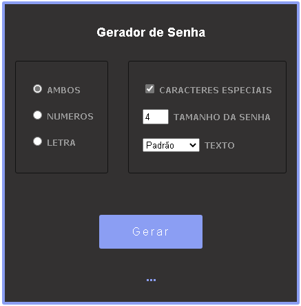
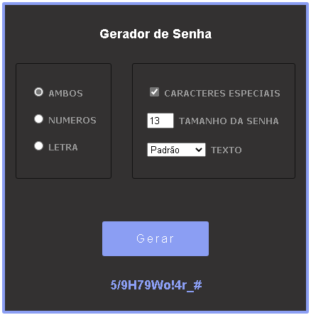

# gerador-de-senha

Um gerador de senha feito com Javascript, Html e Css

<h3>Recursos</h3>
  <ul>
    <li>Gera senhas aleatórias</li>
    <li>Configuração de Simbolos/Caracteres</li>
    <li>Tamanho da Senha</li>
  </ul>
  
  <h3>Screenshot</h3>
    <h4 align="center">
      
    </h4>
    <h4 align="center">
      
    </h4>
